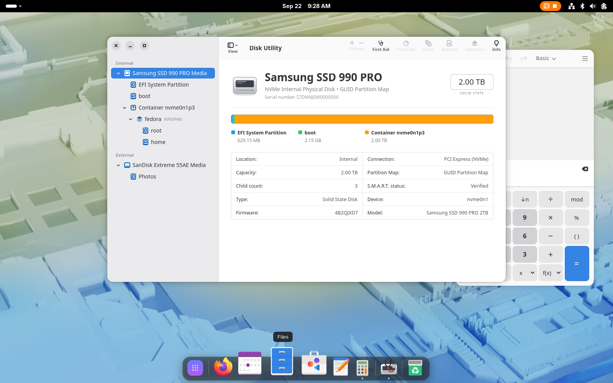
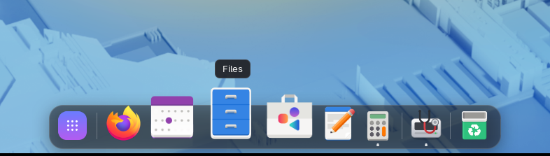
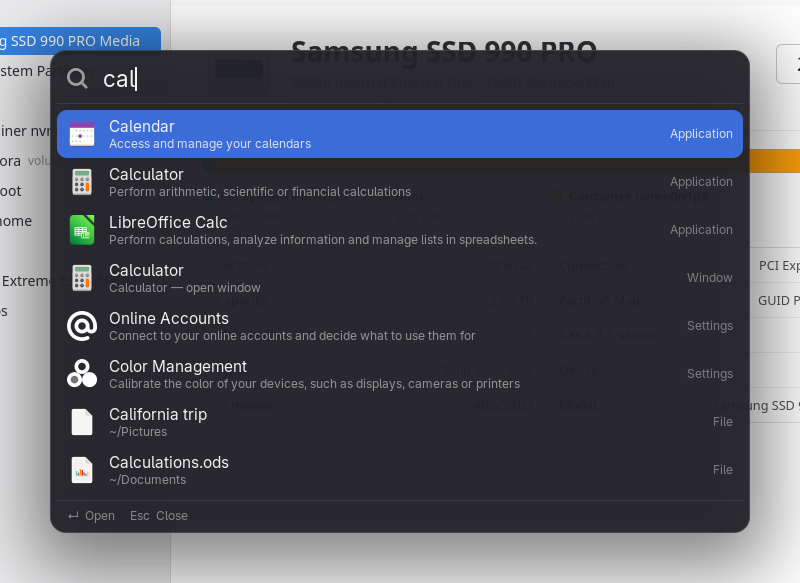
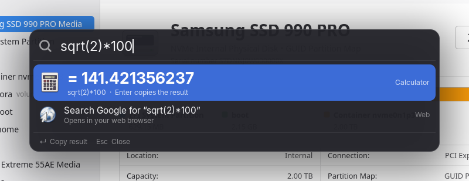
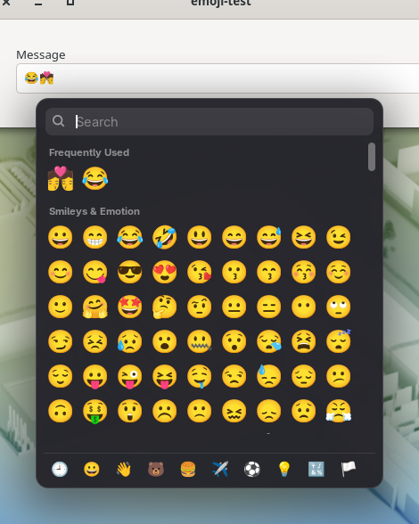
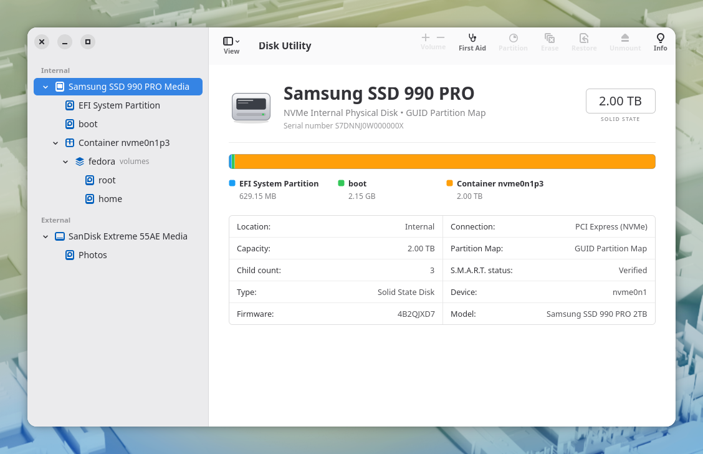

# Homesick



**macOS comforts for GNOME.** Homesick is for people who moved from a Mac to Linux and keep reaching for things that aren't there. It brings back the macOS features you miss most, and it looks and feels like GNOME while doing it.

It's four GNOME Shell extensions and one app. Pick the ones you want:

| | What it is | What it does |
|---|---|---|
| 🧲 **Dock** | GNOME Shell extension | An always-visible dock at the bottom of the screen with icon magnification, running-app dots, app labels, the launch bounce, a Launchpad button and a Trash |
| 🔍 **Spotlight** | GNOME Shell extension | Press **Option+Space** (Alt+Space) to search apps, files, settings and open windows, do maths, open websites or search the web |
| 😀 **Emoji** | GNOME Shell extension | Press **Ctrl+Space** for a macOS-style emoji picker that opens at your text cursor. Search by name or keyword and the emoji is typed straight into the app |
| ↔️ **Option Resize** | GNOME Shell extension | Hold **Super** (the "opt \| start" key on Mac-style keyboards) and drag near a window edge to resize from the centre. Hold **Shift** as well to keep the window's proportions |
| 🩺 **Disk Utility** | App (GTK 4 / libadwaita) | A macOS-style Disk Utility: all disks, partitions, encrypted containers and volumes, usage bars, drive health (S.M.A.R.T.), mounting and ejecting |

Everything installs **for your user only**, so you **don't need sudo** or admin rights.

---

## Requirements

- **GNOME 46 or newer** (tested on **GNOME 50**, Fedora 44 Workstation, Wayland)
- Disk Utility also needs `gjs`, GTK 4 and libadwaita (installed by default on GNOME desktops) and the `udisks2` service. The Erase, Partition and Restore buttons open **GNOME Disks** if you have it installed.

## Install

```bash
git clone https://github.com/Johannett321/homesick.git
cd homesick
./install.sh
```

Then **log out and back in**. GNOME only loads new extensions when you log in. Disk Utility works right away: find it in the app grid, or run `disk-utility`.

### Choosing what to install

```bash
./install.sh --only dock,spotlight      # just these
./install.sh --skip disk-utility        # everything except this
./install.sh --window-buttons-left      # also move close/minimize/maximize to the left, like macOS
./install.sh -y                         # don't ask questions
```

Components: `dock`, `spotlight`, `emoji`, `resize`, `disk-utility`.

### What the installer changes

The installer never overwrites a setting without asking, and it remembers your original values so `./uninstall.sh` can put them back.

- It copies the extensions to `~/.local/share/gnome-shell/extensions/` and enables them.
- It installs Disk Utility to `~/.local/share/homesick/`, with a launcher in `~/.local/bin/disk-utility` and an app-grid entry.
- **Alt+Space** opens GNOME's window menu by default. To use it for Spotlight, the installer offers to free it up. You can still open the window menu by right-clicking a title bar.
- **Window buttons on the left** is optional. The installer asks, or you can pass `--window-buttons-left`.

### Updating

```bash
git pull
./install.sh
```

Then log out and back in to load the updated extensions.

### Uninstall

```bash
./uninstall.sh
```

This removes everything and restores the settings the installer changed.

---

## Using it

### Dock


- **Click** an app to open it, or to bring it to the front if it's already running.
- **Click again** to cycle through its windows, or to minimize it if it has only one window.
- **Middle-click** or **Ctrl+click** opens a new window.
- **Right-click** gives you GNOME's app menu (Pin to Dash, Quit, New Window…).
- Pinned apps come first. Other running apps appear after a divider.
- The dock slides away while the Activities overview is open, and hides for fullscreen apps.

### Spotlight: Option+Space
<p>
  
  
</p>

| Type… | You get |
|---|---|
| `firefox`, `ff`, `vsc` | Apps, with loose matching. Apps you use often rank higher over time |
| `2+2`, `sqrt(16)`, `15%4`, `2^10`, `5!`, `2,5*4` | The answer. **Enter** copies it |
| part of a file name | Files and folders in your home folder |
| `~/Doc`, `/etc/` | Browse that folder. **Tab** goes into the selected folder |
| `wifi`, `display`, `sound` | GNOME Settings pages |
| `lock`, `restart`, `trash` | System commands |
| `github.com` | Opens the website |
| anything | A web search as the last option |

**Enter** opens the result. **Ctrl+Enter** shows a file in Files, and **Alt+Enter** copies its path. **Esc** closes, as does clicking outside or pressing Option+Space again.

### Emoji: Ctrl+Space


- **Ctrl+Space** opens the picker next to your text cursor.
- **Start typing** to search by name or keyword: `joy` finds 😂, `heart` finds ❤️ and friends.
- **Arrow keys** move the selection, **Enter** or a **click** inserts the emoji, and **Esc** closes. Your most recent emoji are shown first.
- The emoji is typed into the app through GNOME's input method, so **your clipboard isn't touched**. Apps without input-method support (some older X11 apps) get it pasted instead, and your clipboard is restored afterwards.
- Heads-up: while the extension is on, **Ctrl+Space** belongs to the picker, so apps that use it themselves (for example, autocomplete in VS Code and JetBrains IDEs) won't see it. You can change the shortcut in the extension file (see below).

### Option Resize
Hold **Super** before you start dragging:

- **Super + drag near an edge or corner** resizes from the centre, so opposite sides move together.
- **Super + Shift + drag** resizes from the centre and keeps the window's proportions.
- **Shift + drag an edge** keeps the proportions.
- **Super + drag in the middle of a window** still moves it, as in standard GNOME.
- **Esc** during the drag puts the window back to its original size.

### Disk Utility


- **Sidebar:** your disks, laid out like macOS: drive → partitions → encrypted container → volume group (Btrfs) → volumes. **View** switches between all devices and volumes only.
- **Detail view:** the capacity, a coloured usage bar and a two-column info table (mount point, space used and available, device, UUID, firmware, partition map…).
- **First Aid** reports your drive's health (warnings, temperature, wear, errors). It checks unmounted volumes.
- **Mount / Unmount / Eject / Unlock** work for external drives, and the view updates live when you plug something in.
- **Erase / Partition / Restore** open GNOME Disks on the selected device. Like on a Mac, they're disabled for the disk your system is running from.
- **Info** shows every property the system reports about a disk or volume.

---

## Customising

Each component keeps its settings as plain constants at the top of its source file:

- **Dock:** `extensions/dock@homesick/extension.js`. Icon size, magnification, whether to show the Launchpad and Trash.
- **Spotlight:** `extensions/spotlight@homesick/extension.js`. The shortcut, search engine, how deep file search goes, and folders to skip.
- **Emoji:** `extensions/emoji@homesick/extension.js`. The shortcut, number of columns and how many recent emoji to keep.
- **Option Resize:** `extensions/resize@homesick/extension.js`. How close to an edge a drag must start.
- **Disk Utility:** colours and spacing in `apps/disk-utility/style.css`.

Edit the file, run `./install.sh` again, then log out and back in.

## Troubleshooting

- **An extension doesn't show up:** log out and back in, then check the **Extensions** app or run `gnome-extensions list --enabled`.
- **Something broke:** look at the log with `journalctl --user -b -g homesick`.
- **Your screen gets stuck** (it shouldn't!): press **Ctrl+Alt+F3**, log in, run `gnome-extensions disable spotlight@homesick` (or whichever extension misbehaved), then go back with **Ctrl+Alt+F2**. Please also open an issue.

## How it works

- The extensions are plain GNOME Shell extensions in modern ES-module format (GNOME 45+).
- Option Resize has to work around one limitation: GNOME's window manager handles resize drags before extensions can see them. So when a drag starts with Super or Shift held, the extension cancels GNOME's resize and runs its own until you release the mouse.
- Disk Utility is a GJS app built with GTK 4 and libadwaita. It reads disks through **UDisks2**, the same service GNOME Disks uses, and finds Btrfs subvolumes in `/proc/self/mountinfo`. Anything that changes a disk goes through UDisks and polkit, so it never needs root.

## Contributing

Issues and pull requests are welcome. To test changes without logging out, run a nested GNOME Shell:

```bash
dbus-run-session gnome-shell --devkit      # GNOME 49+ (use --nested on older versions)
```

Disk Utility has a demo mode with made-up disks, which is handy for development and screenshots:

```bash
DU_DEMO=1 gjs -m apps/disk-utility/main.js
```

## License

GPL-2.0-or-later, the same license as GNOME Shell. See [LICENSE](LICENSE).

Homesick is not affiliated with Apple. macOS, Spotlight and Disk Utility are trademarks of Apple Inc. The names here only describe what each part imitates.
